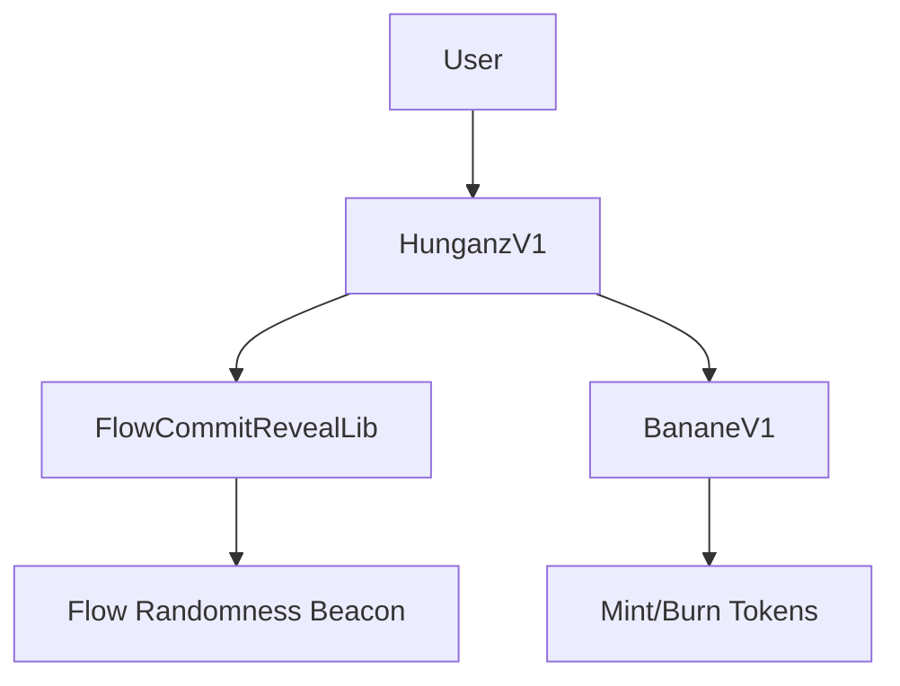

# 📜 Hunganz Smart Contracts Documentation

This directory contains the core smart contracts for the Hunganz gaming NFT ecosystem. Each contract is designed with specific responsibilities and security considerations for a comprehensive gaming experience.

## 🏗️ Contract Architecture

### Core Contracts Overview

```
contracts/
├── HunganzV1.sol              # Main NFT contract (ERC721)
├── BananeV1.sol               # Game token contract (ERC20)
├── FlowCommitRevealLib.sol    # Randomness library
└── test/
    └── MockFlowRandomness.sol # Testing utility
```

## 🦄 HunganzV1.sol - Main NFT Contract

**Purpose**: Core ERC721 NFT contract managing Hunga characters with gaming mechanics.

### Key Features

#### Character System
- **Unique NFTs**: Each Hunga has distinct traits and progression
- **Type System**: Characters belong to different types with varying rarities
- **Evolution Stages**: 5 evolution levels (0-4) with unique artwork
- **Level Progression**: Characters can level up (max level 100)
- **Elemental Types**: Fire (0), Water (1), Plant (2), Air (3)
- **Rarity Tiers**: Common (0), Rare (1), Epic (2), Legendary (3)

#### Pack Opening System
```solidity
struct PackType {
    uint256 id;
    uint256 fromTypeIndex;  // Minimum character type index
    uint256 toTypeIndex;    // Maximum character type index
}
```

- **Commit-Reveal Pattern**: Prevents manipulation of pack outcomes
- **Pack Types**: Different rarities determine character type ranges
- **Fair Distribution**: Uses Flow's randomness beacon for unpredictable results

#### Fetch Quest System
- **Adventure Mechanics**: Send characters on timed quests
- **Reward System**: Earn BananeV1 tokens and experience
- **Transfer Restrictions**: Characters locked during active quests
- **Probability-Based Outcomes**: Success rates vary by character level

### State Variables

```solidity
// Core mappings
mapping(uint256 => Hunga) private _hungas;           // Token ID → Character data
mapping(uint256 => HungaType) private _hungaTypes;   // Type ID → Type definition
mapping(uint256 => PackType) private _packTypes;     // Pack ID → Pack configuration
mapping(address => PackUserData) private _packs;     // User → Pack inventory

// Counters
uint256 private _nextTokenId;      // Next NFT token ID
uint256 private _nextTypeId;       // Next character type ID
uint256 private _hungaTypeCount;   // Total character types
```

### Key Functions

#### Owner Functions
```solidity
function addType(string memory name_, uint256 rarity_, uint256 element_, string[] memory uri_)
function addPackType(uint256 fromTypeIndex, uint256 toTypeIndex)
```

#### User Functions
```solidity
function aquirePack(uint256 packTypeId)           // Commit to pack opening
function openPack()                               // Reveal pack contents
function sendFetch(uint256 tokenId)               // Start fetch quest
function revealFetch(uint256 tokenId)             // Complete fetch quest
function getHungaInfo(uint256 tokenId)            // Get character details
```

### Security Features

- **Access Control**: Owner-only functions for critical operations
- **Transfer Restrictions**: Prevents trading during active quests
- **Commit-Reveal**: Eliminates front-running and manipulation
- **Input Validation**: Comprehensive parameter checking

## 🪙 BananeV1.sol - Game Token Contract

**Purpose**: ERC20 token serving as in-game currency and reward system.

### Key Features

#### Supply Management
- **Maximum Supply**: 21,000,000 tokens (21M * 10^18 wei)
- **Initial Supply**: Configurable at deployment (default: 1M tokens)
- **Controlled Minting**: Only authorized contracts can mint
- **Burn Mechanism**: Tokens can be burned to reduce supply

#### Access Control
```solidity
mapping(address => bool) public hunganzContracts;  // Authorized minters
```

- **Authorization System**: Only approved contracts can mint/burn
- **Owner Management**: Add/remove authorized contracts
- **Secure Operations**: Prevents unauthorized token creation

### Key Functions

#### Owner Functions
```solidity
function addHunganzContract(address _hunganzContract)     // Authorize minter
function removeHunganzContract(address _hunganzContract)  // Revoke authorization
```

#### Authorized Contract Functions
```solidity
function mintByHunganzContract(address to, uint256 amount)    // Mint tokens
function burnByHunganzContract(address from, uint256 amount) // Burn tokens
```

#### View Functions
```solidity
function remainingMintableSupply()  // Available supply for minting
function MAX_SUPPLY()               // Maximum possible supply
```

### Security Features

- **Supply Caps**: Prevents infinite inflation
- **Authorization Checks**: Only approved contracts can mint
- **Overflow Protection**: SafeMath operations
- **Event Logging**: Comprehensive audit trail

## 🎲 FlowCommitRevealLib.sol - Randomness Library

**Purpose**: Secure randomness generation using Flow's native beacon with commit-reveal pattern.

### Commit-Reveal Pattern

The library implements a two-phase randomness system:

1. **Commit Phase**: User commits to a future random source
2. **Reveal Phase**: Random source becomes available and is used

### Key Functions

```solidity
function commitRandom(IFlowRandomness rng) internal returns (uint64)
function requireRevealReady(IFlowRandomness rng, uint64 commitRound) internal view
function revealRandom(IFlowRandomness rng, uint64 commitRound) internal returns (bytes32)
function deriveUint(bytes32 randomSource, uint256 min, uint256 max, bytes memory salt) internal pure returns (uint256)
```

### Security Benefits

- **Unpredictability**: Random source unknown at commit time
- **Verifiability**: All participants can verify randomness
- **Manipulation Resistance**: Cannot influence outcomes after commitment
- **Deterministic**: Same inputs always produce same outputs

### Usage Pattern

```solidity
// 1. Commit phase
uint64 commitRound = rng.commitRandom();

// 2. Wait for reveal readiness (next block)
rng.requireRevealReady(commitRound);

// 3. Reveal phase
bytes32 randomSource = rng.revealRandom(commitRound);
uint256 randomNumber = rng.deriveUint(randomSource, 1, 100, "unique_salt");
```

## 🧪 MockFlowRandomness.sol - Testing Utility

**Purpose**: Mock implementation of Flow's randomness beacon for local development and testing.

### Features

- **Block Height Simulation**: Mimics Flow's block progression
- **Deterministic Randomness**: Reproducible for testing
- **Source Generation**: Creates pseudorandom values
- **Interface Compatibility**: Matches Flow's randomness beacon API

### Key Functions

```solidity
function advanceBlocks(uint64 blocks)                    // Simulate block progression
function futureRound(uint64 roundsAhead)                 // Calculate future rounds
function getRandomSource(uint64 round)                   // Generate random source
function commitRandom()                                  // Commit to randomness
```

### Testing Benefits

- **Predictable Behavior**: Consistent test results
- **Time Control**: Advance blocks manually
- **Debugging**: Inspect random sources
- **Isolation**: No external dependencies

## 🔧 Integration Patterns

### Contract Interaction Flow



### Deployment Dependencies

1. **BananeV1**: Deploy first (no dependencies)
2. **HunganzV1**: Deploy with BananeV1 and randomness beacon addresses
3. **Authorization**: Call `addHunganzContract()` on BananeV1

### Gas Optimization

- **Struct Packing**: Efficient storage layout
- **Batch Operations**: Minimize transaction costs
- **View Functions**: Off-chain data access
- **Event Indexing**: Efficient log filtering

## 🛡️ Security Considerations

### Access Control
- **Owner Privileges**: Limited to configuration functions
- **Contract Authorization**: Strict minting permissions
- **Function Modifiers**: Consistent access checks

### Randomness Security
- **Commit-Reveal**: Prevents manipulation
- **Block Delays**: Ensures unpredictability
- **Deterministic Derivation**: Consistent outcomes

### Economic Security
- **Supply Limits**: Prevents inflation attacks
- **Transfer Restrictions**: Protects game integrity
- **Burn Mechanisms**: Deflationary pressure

## 📊 Gas Usage Estimates

| Function | Estimated Gas | Notes |
|----------|---------------|-------|
| `addType()` | ~150,000 | One-time setup |
| `aquirePack()` | ~80,000 | Commit phase |
| `openPack()` | ~200,000 | Reveal + mint |
| `sendFetch()` | ~70,000 | Start quest |
| `revealFetch()` | ~120,000 | Complete quest |
| `transfer()` | ~50,000 | Standard ERC721 |

## 🔍 Events and Monitoring

### HunganzV1 Events
```solidity
event HungaMinted(address indexed user, uint256 tokenId, uint256 typeId, uint256 typeIndex);
event SentFetching(uint256 tokenId, uint64 commitRound);
event RevealedFetching(uint256 tokenId);
event PackAquired(address indexed user, uint256 packTypeId, uint64 commitRound);
event PackOpened(address indexed user, uint256 packTypeId, uint64 commitRound);
```

### BananeV1 Events
```solidity
event HunganzContractAdded(address indexed hunganzContract);
event HunganzContractRemoved(address indexed hunganzContract);
```

## 🧪 Testing Strategy

### Unit Tests
- **Function Isolation**: Test individual functions
- **Edge Cases**: Boundary conditions and error states
- **Access Control**: Permission verification
- **State Changes**: Verify correct state updates

### Integration Tests
- **Cross-Contract**: Multi-contract interactions
- **Randomness**: Commit-reveal cycles
- **Game Mechanics**: End-to-end gameplay flows

### Security Tests
- **Reentrancy**: Attack vector testing
- **Overflow/Underflow**: Mathematical edge cases
- **Access Control**: Unauthorized access attempts

## 📈 Upgrade Considerations

### Current Implementation
- **Non-Upgradeable**: Contracts are immutable after deployment
- **Configuration**: Owner can add types and pack types
- **Authorization**: Can modify approved minters

### Future Enhancements
- **Proxy Patterns**: Consider upgradeability for future versions
- **Modular Design**: Separate concerns for easier updates
- **Migration Tools**: Data transfer between versions

---

**For implementation details and usage examples, see the main project README.md**
